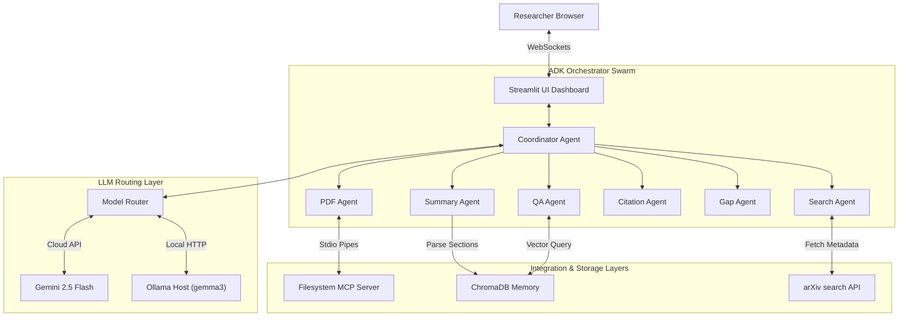

# ScholarSwarm AI: Multi-Agent Research Assistant Swarm

ScholarSwarm AI (Research Assistant Swarm) is a production-grade multi-agent literature synthesist dashboard designed for the **Kaggle AI Agents: Intensive Vibe Coding Capstone**. 

By orchestrating an autonomous swarm of specialized agents via the **Google Agent Development Kit (ADK)** and the **Model Context Protocol (MCP)**, ScholarSwarm AI automates the workflow of extracting, summarizing, citation formatting, literature searching, and gap analysis for multiple academic papers simultaneously.

---

## 1. Project Overview & Problem Statement

Modern researchers are flooded with thousands of scientific publications. Manually reading papers, extracting core methodologies, searching for related work, formulating bibliography records (APA, IEEE, BibTeX), and identifying remaining research gaps takes hours of manual effort.

**ScholarSwarm AI** resolves this problem by implementing a collaborative multi-agent swarm. When a document is uploaded:
1. The **PDF Agent** extracts and sanitizes raw text.
2. The **Summary Agent** compiles structured section outlines.
3. The **Search Agent** fetches related papers from arXiv/Semantic Scholar.
4. The **Citation Agent** formats accurate citations.
5. The **Gap Agent** identifies open research limitations.
6. The **Memory Manager** chunks and embeds summaries to support grounded **Interactive RAG Q&A** with source citations.

---

## 2. Key Features

* **Google ADK Orchestration**: Leverages ADK sequential agent structures and task runners over live websockets for robust orchestration.
* **Dynamic Model Router**: Supports a local-first architecture (Ollama with `gemma3:12b` primary / `llama3.1:8b` fallback) and cloud-based advanced reasoning (Gemini 2.5 Flash), selectable from the sidebar.
* **Grounded RAG QA Assistant**: Splits papers into granular sections (Objective, Method, Dataset, Results, Limitations) in ChromaDB and answers user questions by citing matching papers and sections.
* **Client-Side Citation Graph**: Generates an interactive, animated, glassmorphic Vis.js node network showing relationships between the current paper, arXiv citations, and ChromaDB similarities.
* **Pluggable MCP Architecture**: Connects to the host system via JSON-RPC 2.0 Stdio pipes, integrating Filesystem and GitHub MCP servers.
* **Multi-Tiered Security Layer**:
  * **File Validation**: Validates file headers using magic-number checks (e.g., verifying `\x25\x50\x44\x46` bytes for PDFs).
  * **Prompt Injection Scanner**: Blocks adversarial inputs using regex filters.
  * **PII Scrubbing**: Masks emails, phone numbers, and IP addresses before model routing.

---

## 3. Tech Stack

* **Orchestration**: Google Agent Development Kit (ADK)
* **LLM Engine**: Google Gemini 2.5 Flash / Ollama (`gemma3:12b`, `llama3.1:8b`)
* **Vector Store**: ChromaDB
* **Embeddings**: SentenceTransformers (`all-MiniLM-L6-v2`)
* **Text Extraction**: PyMuPDF (fitz) / python-docx
* **Protocol Integration**: Model Context Protocol (MCP)
* **Frontend UI**: Streamlit with custom dark-mode CSS

---

## 4. System Architecture Diagram



---

## 5. Folder Structure

```text
research-assistant-swarm/
├── LICENSE                       # MIT License for open-source compliance
├── README.md                     # Comprehensive project documentation
├── Dockerfile                    # Containerization rules for cloud deployment
├── docker-compose.yml            # Multi-container orchestration rules
├── app.py                        # Streamlit dashboard and UI styling
├── requirements.txt              # Project package dependencies
├── agents/                       # Multi-agent definitions (ADK wrappers)
│   ├── coordinator_agent.py      # Sequential ADK orchestrator
│   ├── qa_agent.py               # RAG-based interactive chat agent
│   └── pdf_agent.py              # Parsing coordinator
├── data/                         # Local volume storage path
│   ├── chroma_db/                # Persistent vector database files
│   └── uploads/                  # Temporary staging files
├── prompts/                      # Centralized prompts directory
│   └── agent_prompts.py          # Centralized LLM instruction constants
└── tools/                        # Auxiliary utility modules
    ├── model_router.py           # Local Ollama / cloud Gemini router
    ├── memory_tool.py            # ChromaDB vector interfaces
    └── security_tool.py          # Signatures, PII masking, and injection checks
```

---

## 6. Installation & Setup Guide

### Prerequisites
* Python 3.10+
* Node.js & `npx` (required for running MCP servers)
* Ollama (optional, for local model execution)

### 1. Clone the Repository
```bash
git clone https://github.com/your-username/research-assistant-swarm.git
cd research-assistant-swarm
```

### 2. Create Virtual Environment
```bash
python -m venv .venv
# On Windows PowerShell:
.venv\Scripts\Activate.ps1
# On macOS/Linux:
source .venv/bin/activate
```

### 3. Install Dependencies
```bash
pip install --upgrade pip
pip install -r requirements.txt
```

### 4. Configure Environment Variables
Create a `.env` file in the root directory:
```env
GEMINI_API_KEY=your_gemini_api_key_here
OLLAMA_HOST=http://localhost:11434
MODEL_PROVIDER=ollama
```

### 5. Pull Local Ollama Models (Optional)
Ensure the Ollama application is active, then run:
```bash
ollama pull gemma3:12b
ollama pull llama3.1:8b
```

---

## 7. Running the Application

Start the Streamlit dashboard:
```bash
streamlit run app.py
```
Open `http://localhost:8501` in your browser.

### Processing a Research Paper
1. Select the **LLM Provider** (Ollama Only, Gemini Only, or Hybrid) in the sidebar.
2. Upload one or more PDF research papers under the **PDF Summarizer** tab.
3. Click **Analyze Documents** to execute the multi-agent swarm.
4. View the structured summary, citations, gaps, arXiv references, and the **Citation & Influence Graph**.
5. Switch to the **Swarm QA Assistant** tab to ask questions (e.g. *"What dataset is used in paper A?"*) with precise source citations.

---

## 8. Development & Verification Testing

To execute all unit and integration tests (validating memory, routing, security, and coordinator flows):
```bash
python scratch/run_all_tests.py
```
*Note: Make sure your local Ollama server is running or the `GEMINI_API_KEY` is set to ensure all tests pass.*

---

## 9. Future Work Roadmap

1. **Google Drive MCP Server**: Add dynamic synchronization with cloud storage.
2. **Auto-Generated Paper Progression Timeline**: Group papers chronologically and trace how methodologies evolve over time.
3. **Advanced Citation Analysis**: Parse references inside PDF text and generate inline bibliography citations automatically.
